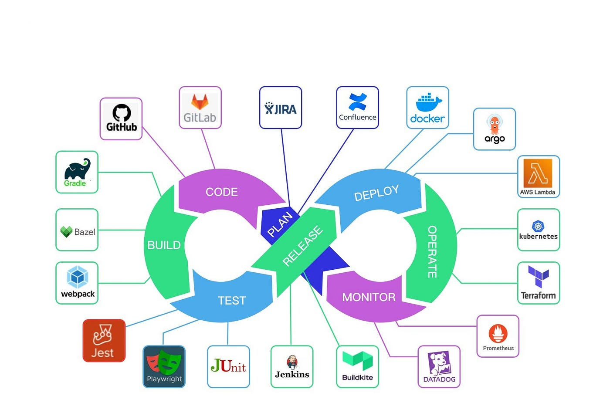
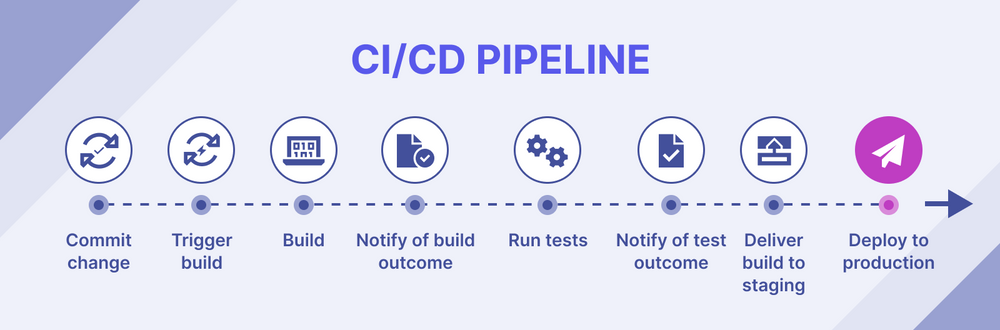

# Project 1 — CI/CD Pipeline

# DevOps CI/CD Pipeline with GitHub Actions

This project demonstrates how to build an automated CI/CD pipeline that builds and deploys a containerized application when code is pushed to the repository.

The pipeline uses GitHub Actions to automate the build and deployment workflow.

# Project Overview

The goal of this project is to simulate a real DevOps workflow where code changes trigger automated build and deployment processes.

When code is pushed to the repository:

        1. GitHub Actions workflow is triggered
        2. Application is built
        3. Docker image is created
        4. Application is deployed to a server

This removes the need for manual deployment.

# Architecture:

    Developer
        ↓
    GitHub Repository
        ↓
    GitHub Actions CI/CD Pipeline
        ↓
    Build Docker Image
        ↓
    Deploy to Server (EC2)

# Project Structure:

devops-cicd-pipeline/  
    app/  
    ├── app.js  
    ├── package.json  
    └── Dockerfile  
    .github/workflows/  
    └── main.yml  
    README.md  

# Tools Used:

CI/CD Platform

    • GitHub Actions

Containerization

    • Docker

Cloud Infrastructure

    • Amazon EC2

Version Control

    • GitHub

# CI/CD Workflow

Pipeline steps executed:

        1. Checkout repository
        2. Install dependencies
        3. Build application
        4. Build Docker image
        5. Deploy to server

Example workflow trigger:

    on:
    push:
        branches:
        - main

This means every push to the main branch triggers the pipeline.

# Deployment Process

When a developer pushes code:

        1. GitHub Actions starts a workflow
        2. The application is built
        3. A Docker image is created
        4. The application is deployed to the server

This ensures deployments are automated and consistent.

# What This Project Demonstrates
        • Continuous Integration
        • Continuous Deployment
        • Automated builds
        • Automated deployments
        • Containerized application delivery

# Future Improvements
        • Push Docker images to Docker Hub
        • Add automated testing stage
        • Integrate with Kubernetes deployments

# Screenshots

Install dependencies

Docker Build Application

 

Docker Run Application

 

Application on Browser

 

Docker Hub Login

Docker Tag and Image Push to Docker Hub

Login to EC2 Instance

Docker on EC2 Instance

Pull Docker Image on EC2 Instance

Docker Run Application on EC2 Instance

 

Application on EC2 Instance IP 

Adding SSH keys on EC2 Instance  

CICD Pipeline - Deploy to EC2 Server from GitHub Actions

